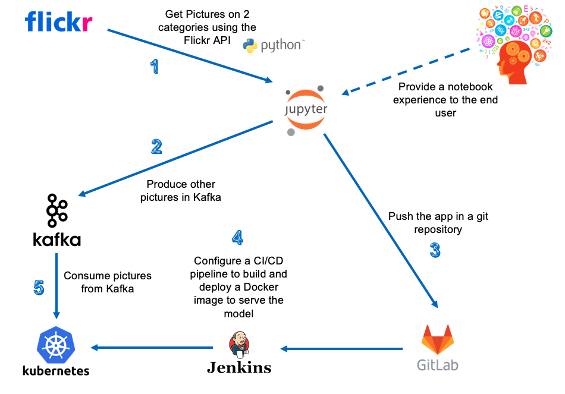
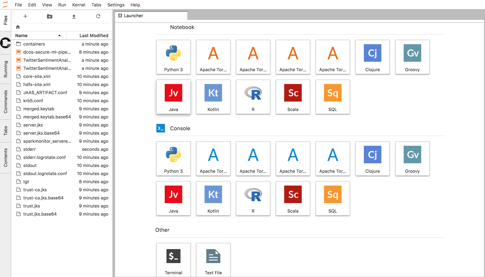
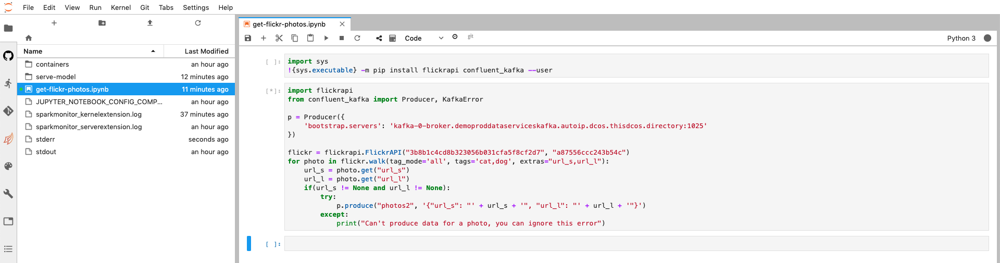
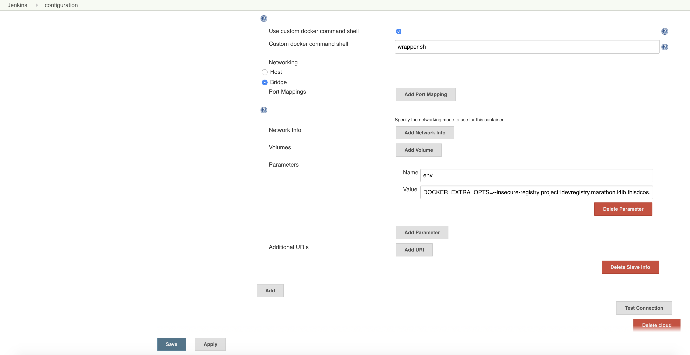
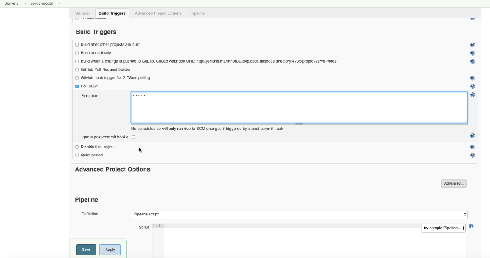
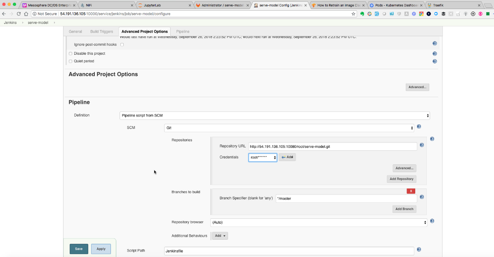
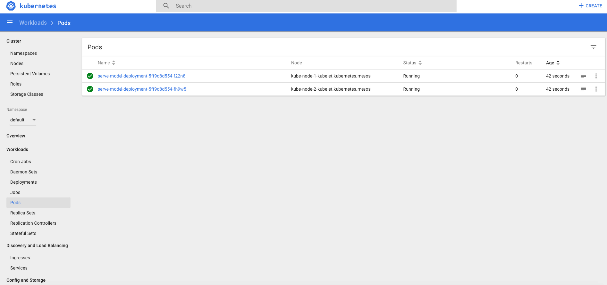
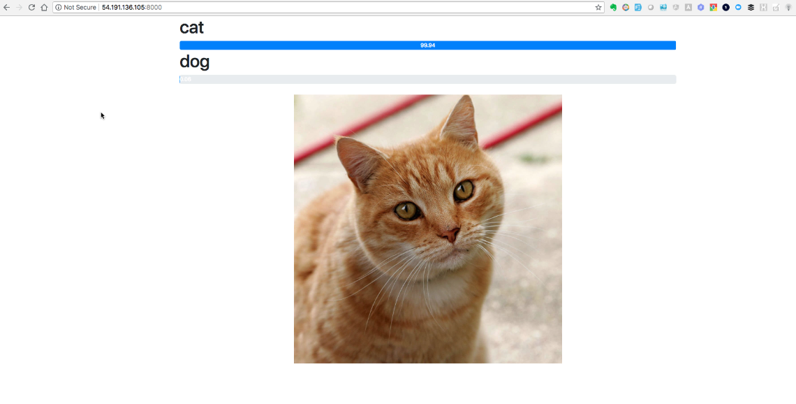

# DC/OS ML Pipeline

In this version of the demo, I use Jupyterlab to execute a Python script that gets some pictures of cats and dogs from the Flickr API, produce them in Kafka and use a CI/CD pipeline (using Gitlab and Jenkins) to deploy on Kubernetes a web application leveraging a Tensorflow model to classify the pictures (by uploading a picture or consuming from Kafka).



## Prerequisites

You need to provision a DC/OS Enterprise Edition cluster in either `permissive` or `strict` mode.

It has been validated with CentOS 7.5.

A DC/OS cluster with at least 10 private agents providing 50 CPU and 96 GB of RAM is required.

If you deploy it in strict mode, you need to setup the DCOS cli using `https` (dcos cluster setup `https://`).

You need to make sure `jq` and a JRA are installed on your computer.

## Deployment

Edit the `install-light.sh` to update the environment variables, especially the 4 first lines:

```
export APPNAME=demo
export OSUSER=centos
export MASTERIP=18.206.220.22
export PUBLICIP=100.24.13.32
```

You simply need to execute the following command:

```
./install-light.sh
```

## Demo script

Run the following command to launch the Jupyter notebook in your web browser:

```
./open-jupyterlab.sh
```

The password is `jupyter`



Click on the `Terminal` icon to launch a terminal inside the Notebook.

Run the following command to launch gitlab in your web browser:

```
./open-gitlab.sh
```

Set the password to `password`, login with the user `root` and this password and create a new public project called `serve-model`.

Go back to the terminal in the Jupyter lab notebook and run the following command to initialize the git repo.

You need to replace `${APPNAME}` by the value you set in the `install.sh` script.

```
cd ~/serve-model
git config --global user.name "Administrator"
git config --global user.email "admin@example.com"
git init
git remote add origin http://${APPNAME}devgitlab.marathon.l4lb.thisdcos.directory/root/serve-model.git
git add .
git commit -a -m "First commit"
git push -u origin master
```

It will ask for the username and password of Gitlab (`root` / `password`)

Open the `get-flickr-photos.ipynb` notebook, select the first paragraph and click on play button.

Then, click on `Kernel` and select `Restart Kernel`.

Finally, select the second paragraph and click on play button. It will download pictures from the Flickr API and produce them in Kafka.



Run the following command to launch jenkins in your web browser:

```
./open-jenkins.sh
```

Go to `Manage Jenkins` and click on the `Correct` button on the top right corner.

Check `Pipeline: API` and `Pipeline: Step API` and click on `Download now and install after restart`

Check the option to restart automatically Jenkins.

When Jenkins has restarted, click on `Manage Jenkins` and then on `Configure System`.

At the bottom, in the `Mesos cloud` section, click on `Advanced`.

Update the value of `Idle Termination Minutes` to `1440`.

Click again on the other `Advanced` button.

Click on `Add Parameter` and set the `Name` to `env` and the `Value` to `DOCKER_EXTRA_OPTS=--insecure-registry ${APPNAME}devregistry.marathon.l4lb.thisdcos.directory:5000`

You need to replace ${APPNAME} by the value you set in the install.sh script.



Note that we are using a Secure Docker Registry, but the certificate of the DC/OS CA isn't included in the image of the Jenkins executor. That's why we add this Docker option.

Click on `Apply` and then on `Save`.

You can now create the Jenkins pipeline that will build the Docker image when a new commit is pushed to the gitlab repo.

Go back to the main page and click on `New Item`.

Call it `serve-model`, select `Pipeline` and click on `OK`.

Check the `Poll SCM` box and set the value to `* * * * *`.



In the `Pipeline` section, select `Pipeline script from SCM` and then `Git` as the SCM.

Specify the gitlab repo URL and the `root/******` credentials.

The gitlab repo URL is `http://${APPNAME}devgitlab.marathon.l4lb.thisdcos.directory/root/serve-model.git`, where you replace `${APPNAME}` by the value you set in the `install.sh` script.



Click on `Apply` and then on `Save`.

This will trigger the jenkins pipeline.


The `install-light.sh` script has configured your `~/.kube/config` file.

You need to run the following command to start the proxy used to access the Kubernetes Dashboard.

```
kubectl proxy
```

Set the `APPNAME` variable with the same value you've specified at the beginning of the `install.sh` script.

Run the following command to launch the Kubernetes Dashboard in your web browser:

```
./open-kubernetes-dashboard.sh
```

You should see the 2 pods created by jenkins.



Run the following command to launch the web application in your web browser:

```
./open-web-app.sh
```

Upload a picture of a cat or a dog and check if the model you retrain works well.



You can also run the following command to launch another page of the web application that is classifying pictures it gets from Kafka:

```
./open-web-app-kafka.sh
```


