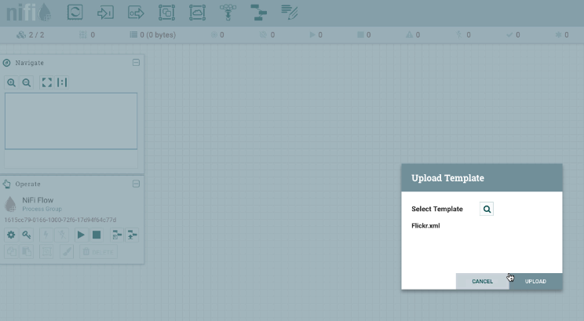
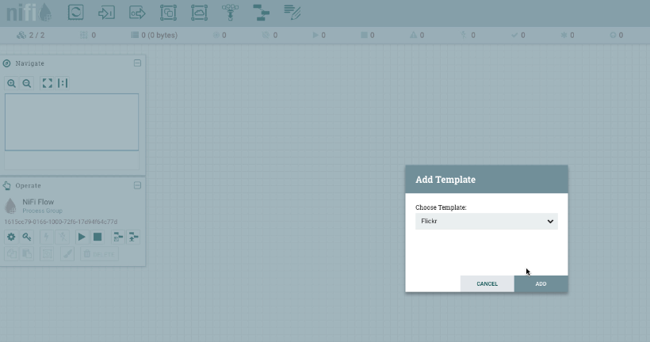
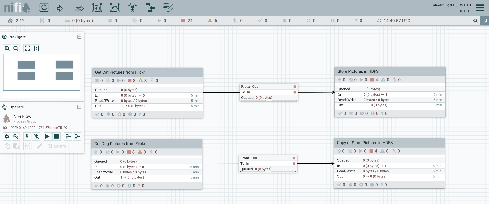
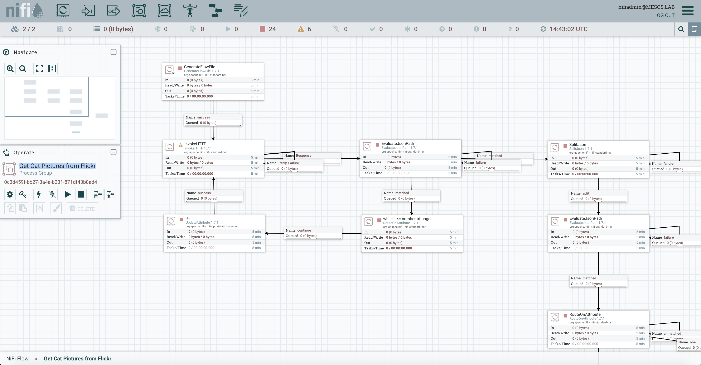
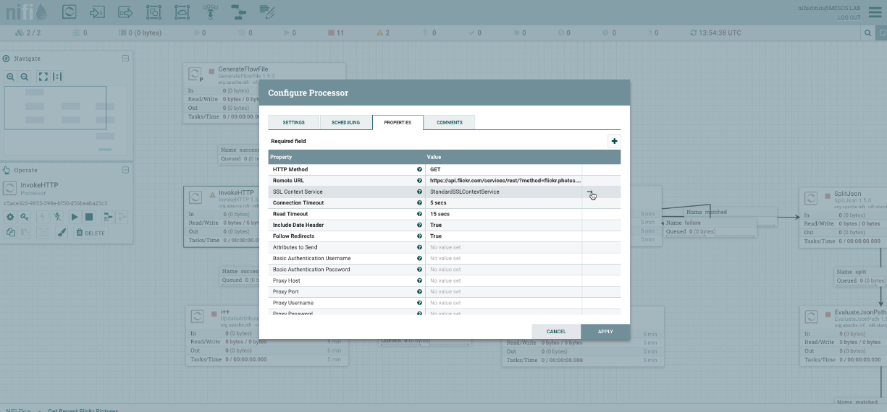
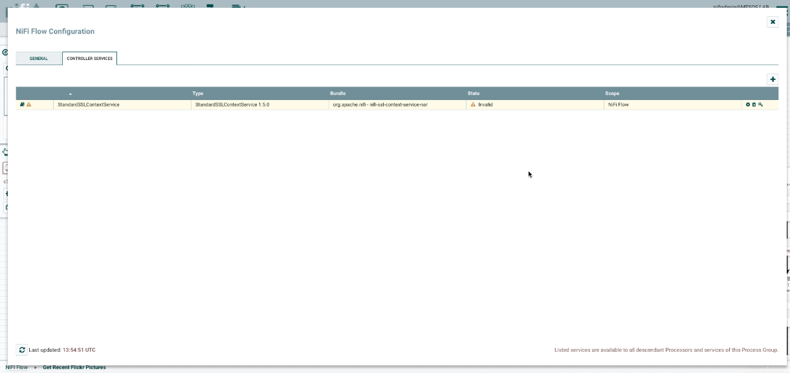
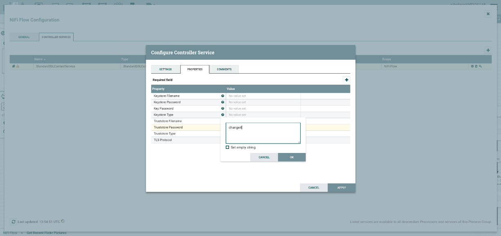
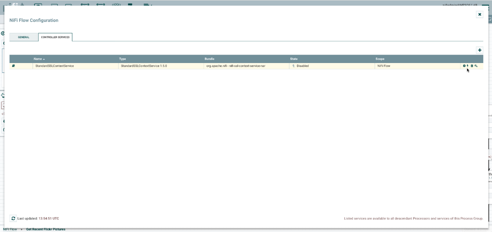

# DC/OS Secure ML Pipeline

In this demo, I've used Apache NiFi to get some pictures of cats and dogs from the Flickr API, stored them in HDFS, retrained a Tensorflow model to classify these new categories and used a CI/CD pipeline (using Gitlab and Jenkins) to deploy on Kubernetes a web application leveraging this model.

## Prerequisites

You need to provision a DC/OS Enterprise Edition cluster in either `permissive` or `strict` mode.

It has been validated with CentOS 7.5 and the install script is deploying the `krb5-workstation` package that is needed for Kerberos.

A DC/OS cluster with at least 10 private agents providing 40 CPU and 128 GB of RAM is required.

If you deploy it in strict mode, you need to setup the DCOS cli using `https` (dcos cluster setup `https://`).

You need to make sure `jq` and a JRA are installed on your computer.

## Deployment

Edit the `install.sh` to update the environment variables, especially the 4 first lines:

```
export APPNAME=demo
export OSUSER=centos
export MASTERIP=18.206.220.22
export PUBLICIP=100.24.13.32
```

You simply need to execute the following command:

```
./install.sh
```

It will deploy Apache HDFS, Kafka (with its own dedicated ZooKeeper), Spark, NiFi and Jupyter with Kerberos and TLS.

A `KDC` will also be deployed, but if you'd like to reuse the same approach to deploy this stack in production, you would skip this step and use your own KDC (which could be Active Directory, for example).

## demo script

Run the following command to launch NiFi in your web browser:

```
./open-nifi.sh
```

Login with `nifiadmin@MESOS.LAB` using the password `password`.


Right click on the background.


Select `Upload template` and upload the `Flickr.xml` file.



Drag and drop the template icon and select the `Flickr` template.



As you can see, there are few warnings. They are corresponding to the sensitive information that can't be stored in a template.



Double click on the `Get Cat Pictures from Flickr` group.



Double click on the first `InvokeHTTP` processor.



Then, click on the arrow in the `SSL Context Service` row.



Click on the `Configure` icon.



Indicate `changeit` for the truststore password.



Click on the `Enable` icon and enable it.

Double click on the `PublishKafka_1_0` processor.

Configure and enable the `SSL Context Service` the same way you did on the previous step.

Go back to the main screen by clicking on `NiFi Flow` on the bottom left.

Double click on the `Get Dog Pictures from Flickr` group.

Double click on the `PublishKafka_1_0` processor.

Configure and enable the `SSL Context Service` the same way you did on the previous step.

Go back to the main screen by clicking on `NiFi Flow` on the bottom left.

Select all the components (ex: `Cmd + A` or `Ctrl + A`) and click on the play button.

There will be few errors due to pictures that aren't available on Flickr. You can ignore them.

Run the following command to launch the Jupyter notebook in your web browser:

```
./open-jupyterlab.sh
```

The password is `jupyter`


Click on the `Terminal` icon to launch a terminal inside the Notebook.

Run the following command until the value doesn't change anymore (which means that NiFi has downloaded all the pictures). You should get around 1700 pictures. It will probably take around 15 minutes.

```
hdfs dfs -ls -R /user/nobody/flickr | wc -l
1700
```

Run the following command to launch gitlab in your web browser:

```
./open-gitlab.sh
```

Set the password to `password`, login with the user `root` and this password and create a new public project called `serve-model`.

Go back to the terminal in the Jupyter lab notebook and run the following command to initialize the git repo.

You need to replace `${APPNAME}` by the value you set in the `install.sh` script.

```
cd ~/serve-model
git config --global user.name "Administrator"
git config --global user.email "admin@example.com"
git init
git remote add origin http://${APPNAME}devgitlab.marathon.l4lb.thisdcos.directory/root/serve-model.git
git add .
git commit -a -m "First commit"
git push -u origin master
```

It will ask for the username and password of Gitlab (`root` / `password`)

Run the following command to launch jenkins in your web browser:

```
./open-jenkins.sh
```

Go to `Manage Jenkins` and click on the `Correct` button on the top right corner.

Check `Pipeline: API` and `Pipeline: Step API` and click on `Download now and install after restart`

Check the option to restart automatically Jenkins.

When Jenkins has restarted, click on `Manage Jenkins` and then on `Configure System`.

At the bottom, in the `Mesos cloud` section, click on `Advanced`.

Update the value of `Idle Termination Minutes` to `1440`.

Click again on the other `Advanced` button.

Click on `Add Parameter` and set the `Name` to `env` and the `Value` to `DOCKER_EXTRA_OPTS=--insecure-registry ${APPNAME}devregistry.marathon.l4lb.thisdcos.directory:5000`

You need to replace ${APPNAME} by the value you set in the install.sh script.


Note that we are using a Secure Docker Registry, but the certificate of the DC/OS CA isn't included in the image of the Jenkins executor. That's why we add this Docker option.

Click on `Apply` and then on `Save`.

You can now create the Jenkins pipeline that will build the Docker image when a new commit is pushed to the gitlab repo.

Go back to the main page and click on `New Item`.

Call it `serve-model`, select `Pipeline` and click on `OK`.

Check the `Poll SCM` box and set the value to `* * * * *`.


In the `Pipeline` section, select `Pipeline script from SCM` and then `Git` as the SCM.

Specify the gitlab repo URL and the `root/******` credentials.

The gitlab repo URL is `http://${APPNAME}devgitlab.marathon.l4lb.thisdcos.directory/root/serve-model.git`, where you replace `${APPNAME}` by the value you set in the `install.sh` script.


Click on `Apply` and then on `Save`.

Go back to the terminal in the Jupyter lab notebook.

Download the Tensorflow script in the home directory to retrain the image classifier.

```
cd ~
curl -LO https://raw.githubusercontent.com/tensorflow/hub/r0.4/examples/image_retraining/retrain.py
```

Retrain the model by indicating the path where the files have been uploaded in HDFS.

```
python retrain.py --image_dir hdfs://hdfs/user/nobody/flickr
```

It will probably take around 15 minutes.

When the scripts terminates, upload the model generated under `~/serve-model` and push a new commit in the git repo.

```
cd ~/serve-model
cp /tmp/output* .
git add .
git commit -a -m "With model"
git push
```

This will trigger the jenkins pipeline.


The `install.sh` script has configured your `~/.kube/config` file.

You need to run the following command to start the proxy used to access the Kubernetes Dashboard.

```
kubectl proxy
```

Set the `APPNAME` variable with the same value you've specified at the beginning of the `install.sh` script.

Run the following command to launch the Kubernetes Dashboard in your web browser:

```
./open-kubernetes-dashboard.sh
```

You should see the 2 pods created by jenkins.


Run the following command to launch the web application in your web browser:

```
./open-web-app.sh
```

Upload a picture of a cat or a dog and check if the model you retrain works well.


You can also run the following command to launch another page of the web application that is classifying pictures it gets from Kafka:

```
./open-web-app-kafka.sh
```


