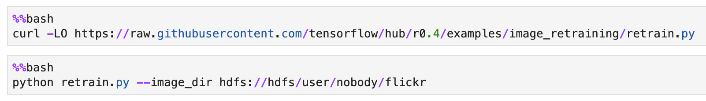

# DC/OS Secure ML Pipeline

In this demo, I use Apache NiFi to get some pictures of cats and dogs from the Flickr API, store half of them in HDFS and produce the other half in Kafka, retrain a Tensorflow model to classify the pictures using Jupyterlab and use a CI/CD pipeline (using Gitlab and Jenkins) to deploy on Kubernetes a web application leveraging this model (by uploading a picture or consuming from Kafka).


There is lighter version of this demo available [here](README-light.md).

There are also 2 additional demos:

- the Spam/Ham demo that allow you to understand how to use the DC/OS Spark service with secured (Kerberos and TLS) HDFS and Kafka
- the TensorFlowOnSpark demo to allow you to understand how to use distributed TensorFlow, GPUs and Mesos quotas.

## Prerequisites

You need to provision a DC/OS 2.0 Enterprise Edition cluster in either `permissive` or `strict` mode.

It has been validated with CentOS 7.5 and the install script is deploying the `krb5-workstation` package that is needed for Kerberos.

A DC/OS cluster with at least 10 private agents providing 60 CPU and 128 GB of RAM is required.

If you deploy it in strict mode, you need to setup the DCOS cli using `https` (dcos cluster setup `https://`).

You need to make sure `jq` and a JRA are installed on your computer.

## Deployment

Edit the `install.sh` to update the environment variables, especially the 4 first lines:

```
export APPNAME=demo
export OSUSER=centos
```

You simply need to execute the following command:

```
./install.sh
```

It will deploy Apache HDFS, Kafka (with its own dedicated ZooKeeper), NiFi and Jupyter with Kerberos and TLS.

A `KDC` will also be deployed, but if you'd like to reuse the same approach to deploy this stack in production, you would skip this step and use your own KDC (which could be Active Directory, for example).

## Demo script

Run the following command to launch NiFi in your web browser:

```
./open-nifi.sh
```

Login with `nifiadmin@MESOS.LAB` using the password `password`.


Right click on the background.


Select `Upload template` and upload the `Flickr.xml` file.


Drag and drop the template icon and select the `Flickr` template.


As you can see, there are few warnings. They are corresponding to the sensitive information that can't be stored in a template.


Double click on the `Get Cat Pictures from Flickr` group.


Double click on the first `InvokeHTTP` processor.


Then, click on the arrow in the `SSL Context Service` row.


Click on the `Configure` icon.


Indicate `changeit` for the truststore password.


Click on the `Enable` icon and enable it. You may have to click on the `Refresh` icon to have access to the `Enable` icon.

Double click on the `PublishKafka_1_0` processor.

Configure and enable the `SSL Context Service` the same way you did on the previous step.

Go back to the main screen by clicking on `NiFi Flow` on the bottom left.

Double click on the `Get Dog Pictures from Flickr` group.

Double click on the `PublishKafka_1_0` processor.

Configure and enable the `SSL Context Service` the same way you did on the previous step.

Go back to the main screen by clicking on `NiFi Flow` on the bottom left.

Select all the components (ex: `Cmd + A` or `Ctrl + A`) and click on the play button.

There will be few errors due to pictures that aren't available on Flickr. You can ignore them.

Run the following command to launch the Jupyter notebook in your web browser:

```
./open-data-science-engine-cpu.sh
```

The password is `jupyter`


Open the `flickr.ipynb` notebook and run the first paragraph until the value doesn't change anymore (which means that NiFi has downloaded all the pictures). You should get around 2000 pictures. It will probably take around 15 minutes.


Run the following command to launch gitlab in your web browser:

```
./open-gitlab.sh
```

Set the password to `password`, login with the user `root` and this password and create a new public project called `serve-model`.

Go back to the notebook in Jupyterlab and run the second paragraph to initialize the git repo.


Run the following command to launch jenkins in your web browser:

```
./open-jenkins.sh
```

Go to `Manage Jenkins` and click on `Configure System`.

At the bottom, in the `Mesos cloud` section, click on `Advanced`.

Update the values of `Jenkins Slave Memory in MB` to `2048`, of `Jenkins Executor Memory in MB` to `2048` and of `Idle Termination Minutes` to `1440`.

Click again on the other `Advanced` button.

Click on `Add Parameter` and set the `Name` to `env` and the `Value` to `DOCKER_EXTRA_OPTS=--insecure-registry ${APPNAME}devregistry.marathon.l4lb.thisdcos.directory:5000`

You need to replace ${APPNAME} by the value you set in the install.sh script.


Note that we are using a Secure Docker Registry, but the certificate of the DC/OS CA isn't included in the image of the Jenkins executor. That's why we add this Docker option.

Click on `Apply` and then on `Save`.

You can now create the Jenkins pipeline that will build the Docker image when a new commit is pushed to the gitlab repo.

Go back to the main page and click on `New Item`.

Call it `serve-model`, select `Pipeline` and click on `OK`.

Check the `Poll SCM` box and set the value to `* * * * *`.


In the `Pipeline` section, select `Pipeline script from SCM` and then `Git` as the SCM.

Specify the gitlab repo URL and the `root/******` credentials.

The gitlab repo URL is `http://${APPNAME}devgitlab.marathon.l4lb.thisdcos.directory/root/serve-model.git`, where you replace `${APPNAME}` by the value you set in the `install.sh` script.


Click on `Apply` and then on `Save`.

Go back to the notebook in Jupyter lab and run the third and fourth paragraphs to download the Tensorflow script in the home directory and to retrain the image classifier.



It will probably take around 15 minutes.

When it terminates, run the last paragraph to upload the model generated under `~/serve-model` and push a new commit in the git repo.


This will trigger the jenkins pipeline.


The `install.sh` script has configured your `~/.kube/config` file.

You need to run the following command to start the proxy used to access the Kubernetes Dashboard.

```
kubectl proxy
```

Set the `APPNAME` variable with the same value you've specified at the beginning of the `install.sh` script.

Run the following command to launch the Kubernetes Dashboard in your web browser:

```
./open-kubernetes-dashboard.sh
```

You should see the 2 pods created by jenkins.


Run the following command to launch the web application in your web browser:

```
./open-web-app.sh
```

Upload a picture of a cat or a dog and check if the model you retrain works well.


You can also run the following command to launch another page of the web application that is classifying pictures it gets from Kafka:

```
./open-web-app-kafka.sh
```


## Spam/Ham demo

The `create-model.sh` script creates the model using Spark and the SMSSpamCollection.txt text file that contains examples of spams and hams. This file has already been uploaded to an Amazon S3 bucket to simplify the process.


The model is stored in HDFS.

The `generate-messages.sh` script generates new random messages. It is another Spark job and it's also leveraging the SMSSpamCollection.txt file to generate them. These messages are produced in Kafka.


Execute these 2 scripts to launch the 2 Spark jobs.


We'll now use the model previously created to classify the incoming messages. It will consume the messages from Kafka and will display the accuracy of the process.


Run the following command to launch the Jupyter notebook in your web browser:

```
./open-data-science-engine-cpu.sh
```

Open the `spam-ham.ipynb` notebook and execute the 3 first paragraphs to consumed the messages from Kafka and calculate the accuracy of the model in predicting Spams and Hams.


You can take a look at the Mesos UI to see the tasks running.


You can also see that there is a quota applied to this Jupyterlab instance.


Then, click on `Kernel` and select `Shutdown Kernel` to release the resources.

## TensorFlowOnSpark demo

By combining salient features from the TensorFlow deep learning framework with Apache Spark and Apache Hadoop, [TensorFlowOnSpark](https://github.com/yahoo/TensorFlowOnSpark) enables distributed deep learning on a cluster of GPU and CPU servers.

In this demo, we are using the MNIST database to train a model recognizing handwritten digits.

We'll start with CPUs.


Run the following command to launch the Jupyter notebook in your web browser:

```
./open-data-science-engine-cpu.sh
```

Open the `tensorflow_on_spark_mnist_cpu_kerberos.ipynb` notebook and execute all the paragraphs one after the other.


The 6th paragraph will load the MNIST dataset into HDFS while the 8th paragraph will launch the TensorFlowOnSpark job.

Then, click on `Kernel` and select `Shutdown Kernel` to release the resources.

We'll now do the same with GPUs (if you deployed a cluster with GPUs).


Run the following command to launch the Jupyter notebook in your web browser:

```
./open-data-science-engine-gpu.sh
```

Open the `tensorflow_on_spark_mnist_gpu_kerberos.ipynb` notebook and execute all the paragraphs one after the other.


The 6th paragraph will load the MNIST dataset into HDFS while the 8th paragraph will launch the TensorFlowOnSpark job, but this time will use GPUs to create the model.

Then, click on `Kernel` and select `Shutdown Kernel` to release the resources.
